# Todo List API

A RESTful API for managing todo lists and tasks built with TypeScript and Express.

## 🚀 Quick Start

### Prerequisites
- Node.js (v22 or higher)
- npm or yarn

### Installation

#### Option 1: Quick Setup (Recommended)
```bash
git clone <repository-url>
cd todo-list-api
./scripts/setup.sh
```

#### Option 2: Manual Setup
1. Clone the repository:
```bash
git clone <repository-url>
cd todo-list-api
```

2. Install Node.js 22 (using nvm):
```bash
nvm install 22
nvm use 22
```

3. Install dependencies:
```bash
npm install
```

4. Set up environment variables:
```bash
cp .env.example .env
# Edit .env with your configuration
```

4. Start development server:
```bash
npm run dev
```

5. Visit http://localhost:3000/health to verify the API is running

## 🗄️ Database Setup

This API supports both in-memory and PostgreSQL storage options.

### In-Memory Storage (Default)
By default, the API uses an in-memory repository for quick development and testing.

### PostgreSQL Database Setup

#### Using Docker (Recommended)
The project includes Docker Compose configuration for easy PostgreSQL setup:

1. **Start the database**:
```bash
npm run db:start
# or
./scripts/db.sh start
```

2. **Configure the application to use PostgreSQL**:
Edit `.env` file and set:
```bash
REPOSITORY_TYPE=postgres
```

3. **Restart your application**:
```bash
npm run dev
```

#### Database Management Commands

```bash
# Start PostgreSQL database
npm run db:start

# Stop database
npm run db:stop

# Restart database
npm run db:restart

# Reset database (removes all data)
npm run db:reset

# Check database status
npm run db:status

# Connect to database with psql
npm run db:connect

# View database logs
npm run db:logs
```

#### Manual PostgreSQL Setup
If you prefer to use your own PostgreSQL instance:

1. Create a database and user:
```sql
CREATE DATABASE todolist;
CREATE USER todouser WITH PASSWORD 'todopass';
GRANT ALL PRIVILEGES ON DATABASE todolist TO todouser;
```

2. Update your `.env` file with your database credentials:
```bash
REPOSITORY_TYPE=postgres
DB_HOST=localhost
DB_PORT=5432
DB_NAME=todolist
DB_USER=todouser
DB_PASSWORD=todopass
```

#### Database Schema
The PostgreSQL setup automatically creates the following schema:
- `todos` table with auto-incrementing ID, title, description, completed status, and timestamps
- Proper indexes for performance
- Triggers for automatic timestamp updates

#### Database Migrations
To set up or update the database schema, use the migration command:

```bash
npm run migrate
```

This command:
- Runs all SQL files in `src/db/migrations/` in alphabetical order
- Requires PostgreSQL client tools (`psql`) to be installed
- Uses environment variables from `.env` for database connection
- Executes files like `001-create-tables.sql`, `002-seed-data.sql`, etc.

**Prerequisites:**
- PostgreSQL client: `sudo apt-get install postgresql-client` (Ubuntu/Debian) or `brew install postgresql` (macOS)
- Database connection configured in `.env` file

## 📚 API Documentation

The API includes comprehensive Swagger/OpenAPI documentation:

- **Interactive Documentation**: <http://localhost:3000/api-docs>
- **JSON Specification**: <http://localhost:3000/api-docs.json>
- **API Information**: <http://localhost:3000/api/v1/docs>

The Swagger UI provides:

- Complete API endpoint documentation
- Interactive testing interface
- Request/response examples
- Schema definitions
- Authentication requirements (if applicable)

### Quick API Overview

- **Health Checks**: `GET /health`, `GET /api/v1/health`
- **Todo Operations**: All CRUD operations under `/api/v1/todos`
- **Documentation**: Multiple formats for API documentation

### GitHub Pages Deployment

You can deploy the Swagger documentation to GitHub Pages:

#### Automatic Deployment (Recommended)
The repository includes a GitHub Action that automatically builds and deploys documentation to GitHub Pages on every push to main branch.

1. Go to your repository **Settings** → **Pages**
2. Set **Source** to "GitHub Actions"
3. Push changes to the main branch
4. Documentation will be available at: `https://[username].github.io/[repository-name]/`

#### Manual Deployment
Generate static documentation manually:

```bash
npm run docs:generate
```

Then enable GitHub Pages pointing to the `docs/` folder.

## 📜 Available Scripts

- `npm run dev` - Start development server with hot reload
- `npm run build` - Build the project for production
- `npm start` - Start production server
- `npm test` - Run tests
- `npm run test:docs` - Test API documentation endpoints
- `npm run docs:generate` - Generate static documentation for GitHub Pages
- `npm run lint` - Run ESLint
- `npm run lint:fix` - Fix ESLint issues
- `npm run migrate` - Run database migrations from `src/db/migrations/`

## Development Guidelines

### Project Structure
```
src/
├── adapters/           # Hexagonal architecture adapters
│   ├── primary/        # Driving adapters (REST controllers)
│   └── secondary/      # Driven adapters (repositories, external services)
├── controllers/        # HTTP request handlers
├── domain/            # Core business logic and entities
│   ├── ports/         # Interfaces for adapters
│   ├── Todo.ts        # Domain entities
│   └── TodoValueObjects.ts # Value objects
├── routes/            # API route definitions
├── services/          # Application services and use cases
├── config/            # Configuration files
├── __tests__/         # Test files
├── app.ts             # Express application setup
└── index.ts           # Application entry point
```

### Hexagonal Architecture Diagram

For a detailed view of the hexagonal architecture used in this project, see the [Architecture Diagram](./diagrams/hexagonal-architecture.md).

#### Quick Architecture Overview

```mermaid
graph LR
    Client[🌐 Client] --> Primary[🔵 Primary Adapters]
    Primary --> Core[⬢ Application Core]
    Core --> Secondary[🟡 Secondary Adapters]
    Secondary --> DB[(💾 Storage)]
    
    classDef primaryAdapter fill:#e1f5fe,stroke:#01579b,stroke-width:2px
    classDef secondaryAdapter fill:#fff3e0,stroke:#e65100,stroke-width:2px
    classDef core fill:#f3e5f5,stroke:#4a148c,stroke-width:3px
    classDef external fill:#e8f5e8,stroke:#2e7d32,stroke-width:2px
    
    class Primary primaryAdapter
    class Secondary secondaryAdapter
    class Core core
    class Client,DB external
```



#### Architecture Principles

**Hexagonal Architecture (Ports & Adapters) Benefits:**

1. **🔄 Dependency Inversion**: The core domain doesn't depend on external frameworks
2. **🧪 Testability**: Easy to test business logic in isolation
3. **🔌 Pluggability**: Easy to swap adapters (e.g., switch from in-memory to database)
4. **📦 Separation of Concerns**: Clear boundaries between layers
5. **🛡️ Framework Independence**: Core logic is independent of Express, databases, etc.

**Layer Responsibilities:**

- **Primary Adapters**: Handle external requests (HTTP, CLI, tests)
- **Core Domain**: Contains business logic, entities, and use cases
- **Secondary Adapters**: Implement infrastructure concerns (persistence, external APIs)
- **Ports**: Define interfaces/contracts between layers

### Copilot Usage Guidelines

When working with GitHub Copilot on this project:

1. **Follow the coding standards** defined in `.github/instructions/copilot-instructions.md`
2. **Follow TypeScript performance best practices** defined in `TYP.github/instructions/typescript.instructions.md`
3. **Follow REST API architecture standards** defined in `.github/instructions/rest-api-standard.instructions.md`
4. **Use descriptive comments** to help Copilot understand context
5. **Write clear function signatures** with proper TypeScript types
6. **Include JSDoc comments** for complex functions
7. **Follow consistent naming patterns** throughout the codebase

### API Endpoints

All endpoints should follow these patterns:

- `GET /api/todos` - List all todos (with pagination)
- `GET /api/todos/:id` - Get a specific todo
- `POST /api/todos` - Create a new todo
- `PUT /api/todos/:id` - Update a todo
- `DELETE /api/todos/:id` - Delete a todo

### Error Handling

Use consistent error response format:

```json
{
  "error": {
    "code": "ERROR_CODE",
    "message": "Human readable message",
    "details": {}
  }
}
```

### Environment Variables

Required environment variables:

- `NODE_ENV` - Environment (development/production)
- `PORT` - Server port
- `DATABASE_URL` - Database connection string
- `JWT_SECRET` - Secret for JWT tokens
