# Todo List API

A RESTful API for managing todo lists and tasks built with TypeScript, Express, and PostgreSQL following Hexagonal Architecture principles.

## 🏛️ Architecture Overview

This application implements **Hexagonal Architecture** (Ports & Adapters pattern) with the following key characteristics:

- **🔵 Primary Adapters**: REST Controllers handle HTTP requests
- **⬢ Core Domain**: Business logic with TodoService and domain entities
- **🟡 Secondary Adapters**: PostgreSQL repository for data persistence
- **🔌 Ports**: Clear interfaces between layers (ITodoService, ITodoRepository)
- **📦 Modular Services**: Component-based service architecture

## 🚀 Quick Start

### Prerequisites
- Node.js (v22 or higher)
- npm or yarn
- PostgreSQL (via Docker or local installation)

### Installation

#### Option 1: Quick Setup (Recommended)
```bash
git clone <repository-url>
cd todo-list-api
./scripts/setup.sh
```

#### Option 2: Manual Setup
1. Clone the repository:
```bash
git clone <repository-url>
cd todo-list-api
```

2. Install Node.js 22 (using nvm):
```bash
nvm install 22
nvm use 22
```

3. Install dependencies:
```bash
npm install
```

4. Set up environment variables:
```bash
cp .env.example .env
# Edit .env with your configuration
```

5. Start PostgreSQL database:
```bash
docker-compose up -d postgres
```

6. Run database migrations:
```bash
npm run migrate
```

7. Start development server:
```bash
npm run dev
```

8. Visit http://localhost:3000/health to verify the API is running

## 🗄️ Database Setup

This API uses **PostgreSQL** as its primary database with Docker Compose for easy setup.

### Prerequisites

- Docker and Docker Compose installed on your system
- PostgreSQL client tools for running migrations

### Database Setup

#### Using Docker (Recommended)

1. **Start the PostgreSQL database**:

```bash
docker-compose up -d postgres
```

2. **Verify database is running**:

```bash
docker-compose ps
```

3. **Run database migrations**:

```bash
npm run migrate
```

4. **Start your application**:

```bash
npm run dev
```

#### Database Management Commands

```bash
# Start PostgreSQL database
docker-compose up -d postgres

# Stop database
docker-compose down

# Restart database
docker-compose restart postgres

# View database logs
docker-compose logs postgres

# Connect to database with psql
docker-compose exec postgres psql -U postgres -d todolist

# Reset database (removes all data)
docker-compose down -v && docker-compose up -d postgres
```

#### Manual PostgreSQL Setup

If you prefer to use your own PostgreSQL instance:

1. Create a database and user:

```sql
CREATE DATABASE todolist;
CREATE USER postgres WITH PASSWORD 'password';
GRANT ALL PRIVILEGES ON DATABASE todolist TO postgres;
```

2. Update your `.env` file with your database credentials:

```bash
NODE_ENV=development
PORT=3000
API_VERSION=v1

DB_HOST=localhost
DB_PORT=5432
DB_NAME=todolist
DB_USER=postgres
DB_PASSWORD=password
DB_SSL=false
DB_MAX_CONNECTIONS=10
```

#### Database Schema

The PostgreSQL setup automatically creates the following schema through migrations:

- `todos` table with auto-incrementing ID, title, description, completed status, and timestamps
- Proper indexes for performance
- Triggers for automatic timestamp updates

#### Database Migrations

To set up or update the database schema, use the migration command:

```bash
npm run migrate
```

This command:

- Runs all SQL files in `src/db/migrations/` in alphabetical order
- Requires PostgreSQL client tools (`psql`) to be installed
- Uses environment variables from `.env` for database connection
- Executes files like `001-create-tables.sql`, `002-seed-data.sql`, etc.

**Prerequisites:**

- PostgreSQL client: `sudo apt-get install postgresql-client` (Ubuntu/Debian) or `brew install postgresql` (macOS)
- Database connection configured in `.env` file

## 🧪 Testing

The application includes comprehensive testing setup:

### Running Tests

```bash
# Run all tests
npm test

# Run tests in watch mode
npm run test:watch
```

### Test Structure

- **Integration Tests**: `src/__tests__/todos.integration.test.ts` - Test complete API endpoints
- **Health Check Tests**: `src/__tests__/health.test.ts` - Test health endpoints
- **Test Setup**: `src/test-setup.ts` - Common test configuration

### Test Environment

Tests use a separate test environment configuration and can be run independently of the development database.

## 🚀 Development Workflow

### Getting Started

1. **Clone and Setup**:

```bash
git clone <repository-url>
cd todo-list-api
./scripts/setup.sh
```

2. **Start Development Environment**:

```bash
# Start database
docker-compose up -d postgres

# Run migrations
npm run migrate

# Start development server
npm run dev
```

3. **Verify Setup**:

- Health check: http://localhost:3000/health
- API documentation: http://localhost:3000/api-docs
- Example API call: http://localhost:3000/api/v1/todos

### Code Quality

```bash
# Check code formatting and linting
npm run lint

# Auto-fix formatting and linting issues
npm run lint:fix

# Format code only
npm run format
```

### Building and Deployment

```bash
# Build for production
npm run build

# Start production server
npm start
```

## 📚 API Documentation

The API includes comprehensive Swagger/OpenAPI documentation:

- **Interactive Documentation**: <http://localhost:3000/api-docs>
- **JSON Specification**: <http://localhost:3000/api-docs.json>

The Swagger UI provides:

- Complete API endpoint documentation
- Interactive testing interface
- Request/response examples
- Schema definitions

### Quick API Overview

- **Health Checks**: `GET /health`, `GET /api/v1/health`
- **Todo Operations**: All CRUD operations under `/api/v1/todos`
- **Documentation**: Multiple formats for API documentation

### GitHub Pages Documentation Deployment

The Swagger documentation can be deployed to GitHub Pages for easy access:

#### Automatic Deployment (Recommended)

Set up GitHub Actions to automatically deploy documentation:

1. Go to your repository **Settings** → **Pages**
2. Set **Source** to "GitHub Actions"
3. Push changes to the main branch
4. Documentation will be available at: `https://[username].github.io/[repository-name]/`

#### Manual Deployment

You can manually generate and deploy documentation by setting up GitHub Pages to serve from the `docs/` folder and creating static HTML files from your Swagger specification.

## 📜 Available Scripts

- `npm run dev` - Start development server with hot reload
- `npm run build` - Build the project for production
- `npm start` - Start production server
- `npm test` - Run tests
- `npm run test:watch` - Run tests in watch mode
- `npm run lint` - Run ESLint and check code formatting
- `npm run lint:fix` - Fix ESLint issues and format code
- `npm run format` - Format code with Prettier
- `npm run format:check` - Check code formatting
- `npm run migrate` - Run database migrations from `src/db/migrations/`

## Development Guidelines

### Project Structure

```text
src/
├── adapters/                  # Hexagonal architecture adapters
│   └── repositories/         # Secondary adapters (data persistence)
│       └── todoRepository.ts # PostgreSQL repository implementation
├── controllers/              # Primary adapters (HTTP request handlers)
│   ├── todoController.ts    # Todo CRUD operations
│   └── healthController.ts  # Health check endpoints
├── domain/                   # Core business logic and entities
│   ├── Todo.ts              # Domain entity
│   ├── TodoValueObjects.ts  # Value objects and DTOs
│   └── ports/               # Interfaces (contracts)
│       └── TodoPorts.ts     # Service and repository interfaces
├── services/                 # Application services (use cases)
│   ├── TodoService.ts       # Unified service facade
│   └── components/          # Individual service components
│       ├── create-todos.component.ts
│       ├── get-todos.component.ts
│       ├── get-todo-by-id.component.ts
│       ├── update-todos.component.ts
│       └── delete-todo.component.ts
├── routes/                   # API route definitions
│   ├── index.ts             # Route aggregation
│   ├── todoRoutes.ts        # Todo endpoints
│   └── healthRoutes.ts      # Health check routes
├── config/                   # Configuration files
│   ├── index.ts             # Environment configuration
│   └── swagger.ts           # API documentation config
├── db/                       # Database setup and migrations
│   ├── index.ts             # PostgreSQL connection
│   └── migrations/          # SQL migration files
├── __tests__/               # Test files
│   ├── health.test.ts
│   └── todos.integration.test.ts
├── app.ts                    # Express application setup
├── index.ts                  # Application entry point
└── test-setup.ts            # Test configuration
```

### Hexagonal Architecture Implementation

For a detailed view of the hexagonal architecture used in this project, see the [Architecture Diagram](./diagrams/hexagonal-architecture.md).

#### Current Architecture Overview

```mermaid
graph LR
    Client[🌐 HTTP Client] --> Controller[🔵 TodoController]
    Controller --> Service[⬢ TodoService]
    Service --> Components[🔧 Service Components]
    Components --> Repository[🟡 TodoRepository]
    Repository --> DB[(💾 PostgreSQL)]
    
    classDef primaryAdapter fill:#e1f5fe,stroke:#01579b,stroke-width:2px
    classDef secondaryAdapter fill:#fff3e0,stroke:#e65100,stroke-width:2px
    classDef core fill:#f3e5f5,stroke:#4a148c,stroke-width:3px
    classDef external fill:#e8f5e8,stroke:#2e7d32,stroke-width:2px
    
    class Controller primaryAdapter
    class Repository secondaryAdapter
    class Service,Components core
    class Client,DB external
```



#### Architecture Principles

**Hexagonal Architecture (Ports & Adapters) Benefits:**

1. **🔄 Dependency Inversion**: Core domain doesn't depend on external frameworks
2. **🧪 Testability**: Easy to test business logic in isolation
3. **🔌 Pluggability**: Easy to swap adapters (e.g., switch databases)
4. **📦 Separation of Concerns**: Clear boundaries between layers
5. **🛡️ Framework Independence**: Core logic is independent of Express, databases, etc.

**Layer Responsibilities:**

- **Primary Adapters** (`controllers/`): Handle external HTTP requests
- **Core Domain** (`domain/`, `services/`): Contains business logic, entities, and use cases
- **Secondary Adapters** (`adapters/repositories/`): Implement data persistence
- **Ports** (`domain/ports/`): Define interfaces/contracts between layers

**Component-Based Services:**

The application uses a modular approach where the `TodoService` acts as a facade that composes individual service components:

- **Unified Interface**: Single entry point for all todo operations
- **Modular Components**: Each operation (create, read, update, delete) is a separate component
- **Composable Architecture**: Easy to test and maintain individual operations
- **Clear Separation**: Each component has a single responsibility

**Dependency Injection:**

The application uses constructor-based dependency injection to wire up the hexagonal architecture:

```typescript
// In todoRoutes.ts
const todoRepository = new TodoRepository();
const todoService = new TodoService(todoRepository);
const todoController = new TodoController(todoService);
```

This approach ensures:
- **Loose Coupling**: Components depend on interfaces, not concrete implementations
- **Easy Testing**: Dependencies can be easily mocked for unit tests
- **Flexible Configuration**: Different implementations can be injected based on environment

### API Endpoints

Current REST API endpoints following RESTful conventions:

- `GET /health` - Root-level health check
- `GET /api/v1/health` - Versioned health check
- `GET /api/v1/todos` - List all todos (with pagination and filtering)
- `GET /api/v1/todos/:id` - Get a specific todo by ID
- `POST /api/v1/todos` - Create a new todo
- `PUT /api/v1/todos/:id` - Update a todo
- `DELETE /api/v1/todos/:id` - Delete a todo

### Error Handling

The API uses consistent error response format across all endpoints:

```json
{
  "error": {
    "code": "ERROR_CODE",
    "message": "Human readable message"
  }
}
```

Common error codes:
- `ROUTE_NOT_FOUND` - Invalid endpoint
- `TODO_NOT_FOUND` - Todo with specified ID doesn't exist
- `INVALID_TODO_DATA` - Invalid request body
- `INVALID_QUERY_PARAMETERS` - Invalid query parameters
- `INTERNAL_SERVER_ERROR` - Unexpected server error

### Environment Variables

Required environment variables (see `.env.example`):

```bash
NODE_ENV=development
PORT=3000
API_VERSION=v1

# Database Configuration
DB_HOST=localhost
DB_PORT=5432
DB_NAME=todolist
DB_USER=postgres
DB_PASSWORD=password
DB_SSL=false
DB_MAX_CONNECTIONS=10
```
