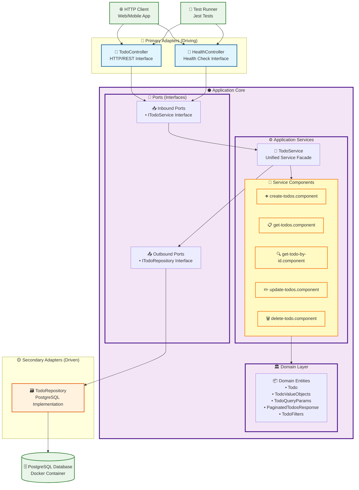

# Hexagonal Architecture Diagram

This diagram illustrates the hexagonal architecture (ports and adapters pattern) used in the Todo List API project.

## Architecture Overview



## Architecture Components

### 🔵 Primary Adapters (Driving Side)

These adapters drive the application and handle incoming requests:

- **TodoController** (`src/controllers/todoController.ts`)
  - Handles HTTP/REST API requests for todo operations
  - Converts HTTP requests to domain operations
  - Returns HTTP responses with proper status codes
  - Implements error handling and input validation

- **HealthController** (`src/controllers/healthController.ts`)
  - Provides health check endpoints
  - Monitors application status
  - Returns system health information

### ⬢ Application Core (The Hexagon)

#### 🔌 Ports (Interfaces)

Define contracts between the core and adapters:

**Inbound Ports** (`src/domain/ports/TodoPorts.ts`):

- `ITodoService` - Main service interface defining all todo operations:
  - `createTodo(todoData)` - Create new todos
  - `getTodos(queryParams)` - Retrieve todos with filtering/pagination
  - `getTodoById(id)` - Retrieve single todo by ID
  - `updateTodo(id, updates)` - Update existing todos
  - `deleteTodo(id)` - Delete todos

**Outbound Ports** (`src/domain/ports/TodoPorts.ts`):

- `ITodoRepository` - Data persistence interface with methods:
  - `findAll(filters)` - Query todos with filters and pagination
  - `findById(id)` - Find single todo by ID
  - `save(todo)` - Persist new todo
  - `update(todo)` - Update existing todo
  - `delete(id)` - Remove todo from storage

#### 🏛️ Domain Layer

Contains core business entities and value objects:

- **Todo** (`src/domain/Todo.ts`) - Core todo entity with business logic
- **TodoValueObjects** (`src/domain/TodoValueObjects.ts`) - Value objects for data transfer:
  - `TodoQueryParams` - Query parameter handling and validation
  - `PaginatedTodosResponse` - Paginated response structure
  - `TodoFilters` - Filtering criteria for database queries

#### ⚙️ Application Services

Implement business logic and use cases:

- **TodoService** (`src/services/TodoService.ts`) - **🎯 Unified Service Facade**
  - Implements `ITodoService` interface
  - Composes individual service components
  - Provides simplified API for primary adapters
  - Handles dependency injection to components

- **Service Components** (`src/services/components/`):
  - `create-todos.component.ts` - Todo creation logic
  - `get-todos.component.ts` - Todo retrieval with filtering/pagination
  - `get-todo-by-id.component.ts` - Single todo retrieval
  - `update-todos.component.ts` - Todo update operations
  - `delete-todo.component.ts` - Todo deletion logic

### 🟡 Secondary Adapters (Driven Side)

These adapters are driven by the application core:

- **TodoRepository** (`src/adapters/repositories/todoRepository.ts`)
  - Implements `ITodoRepository` interface
  - Provides PostgreSQL data persistence
  - Handles database connections using connection pooling
  - Converts between domain entities and database rows
  - Implements complex queries for filtering and pagination
  - Uses parameterized queries for security

## Architecture Principles

### Benefits of Hexagonal Architecture

1. **🔄 Dependency Inversion**
   - Core domain doesn't depend on external frameworks
   - Dependencies point inward toward the domain
   - PostgreSQL repository can be swapped without changing business logic

2. **🧪 Testability**
   - Business logic can be tested in isolation
   - Easy to mock external dependencies
   - Fast unit tests without infrastructure
   - Integration tests can use test databases

3. **🔌 Pluggability**
   - Easy to swap adapter implementations
   - Can switch from PostgreSQL to other databases
   - Add new adapters (GraphQL, gRPC, etc.) without core changes

4. **📦 Separation of Concerns**
   - Clear boundaries between layers
   - Each component has a single responsibility
   - Loose coupling between components

5. **🛡️ Framework Independence**
   - Core logic is independent of Express, databases, etc.
   - Can switch frameworks without rewriting business logic

6. **🎯 Component-Based Services**
   - `TodoService` acts as a facade providing a single entry point
   - Individual service components handle specific operations
   - Maintains service isolation while providing convenience
   - Easy to extend with new operations

### Layer Responsibilities

- **Primary Adapters** (`controllers/`): Handle external HTTP requests and route management
- **Core Domain** (`domain/`, `services/`): Contains business logic, entities, and use cases
- **Secondary Adapters** (`adapters/repositories/`): Implement data persistence with PostgreSQL
- **Ports** (`domain/ports/`): Define interfaces/contracts between layers

### Data Flow

1. **Inbound Flow**: HTTP Client → TodoController → ITodoService → TodoService → Service Components → Domain
2. **Outbound Flow**: Service Components → ITodoRepository → TodoRepository → PostgreSQL Database

### Dependency Injection Pattern

The application uses constructor-based dependency injection:

```typescript
// Wiring in todoRoutes.ts
const todoRepository = new TodoRepository();           // Secondary adapter
const todoService = new TodoService(todoRepository);   // Core service
const todoController = new TodoController(todoService); // Primary adapter
```

This ensures:
- **Loose Coupling**: Components depend on interfaces, not implementations
- **Easy Testing**: Dependencies can be mocked for unit tests
- **Flexible Configuration**: Different implementations based on environment

### Future Extensions

The architecture supports easy extension with:

- **Alternative Database Adapters**: MongoDB, Redis, or other databases
- **External Service Adapters**: Email services, notification systems, caching layers
- **Additional Primary Adapters**: GraphQL, gRPC, CLI interfaces, WebSocket connections
- **Event-driven Components**: Message queues, event stores, pub/sub systems
- **Authentication/Authorization**: JWT handlers, OAuth adapters
- **Monitoring and Observability**: Logging adapters, metrics collectors

## File Structure Mapping

```text
src/
├── adapters/
│   └── repositories/        # � Secondary Adapters
│       └── todoRepository.ts # PostgreSQL implementation
├── controllers/             # � Primary Adapters
│   ├── todoController.ts    # REST API controller
│   └── healthController.ts  # Health check controller
├── domain/                  # ⬢ Core Domain
│   ├── ports/              # 🔌 Ports (Interfaces)
│   │   └── TodoPorts.ts    # Service & Repository interfaces
│   ├── Todo.ts             # 📦 Domain Entity
│   └── TodoValueObjects.ts # Value objects and DTOs
├── services/               # ⚙️ Application Services
│   ├── TodoService.ts      # 🎯 Unified Service Facade
│   └── components/         # 🔧 Service Components
│       ├── create-todos.component.ts
│       ├── get-todos.component.ts
│       ├── get-todo-by-id.component.ts
│       ├── update-todos.component.ts
│       └── delete-todo.component.ts
├── routes/                 # Route Configuration
│   ├── index.ts           # Route aggregation
│   ├── todoRoutes.ts      # Todo route definitions & DI
│   └── healthRoutes.ts    # Health route definitions
├── config/                 # Configuration
│   ├── index.ts           # Environment configuration
│   └── swagger.ts         # API documentation config
├── db/                     # Database Setup
│   ├── index.ts           # PostgreSQL connection
│   └── migrations/        # SQL migration files
├── __tests__/             # Test Files
│   ├── todos.integration.test.ts
│   └── health.test.ts
├── app.ts                  # Express application setup
├── index.ts                # Application entry point
└── test-setup.ts          # Test configuration
```

## Implementation Highlights

### Component-Based Service Architecture

The current implementation uses a **component-based approach** where:

1. **TodoService** acts as a **Facade Pattern** implementation
2. Individual **service components** handle specific operations
3. **Single Responsibility Principle** is maintained at the component level
4. **Composition over Inheritance** is used for building complex operations

### Database Integration

- **PostgreSQL** as the primary database with Docker support
- **Connection pooling** for performance and resource management
- **SQL migrations** for schema versioning
- **Parameterized queries** for security
- **Transaction support** for data consistency

### Error Handling Strategy

- **Consistent error response format** across all endpoints
- **Domain-specific error codes** for client-side handling
- **Proper HTTP status codes** mapping
- **Development vs Production error details** configuration
