# Architecture Guide

## Hexagonal Architecture Implementation

This project implements **Hexagonal Architecture** (Ports & Adapters pattern) with a focus on clean separation of concerns and testability.

### Current Architecture Overview

```mermaid
graph LR
    Client[🌐 HTTP Client] --> Controller[🔵 TodoController]
    Controller --> Service[⬢ TodoService]
    Service --> Components[🔧 Service Components]
    Components --> Repository[🟡 TodoRepository]
    Repository --> DB[(💾 PostgreSQL)]
    
    classDef primaryAdapter fill:#e1f5fe,stroke:#01579b,stroke-width:2px
    classDef secondaryAdapter fill:#fff3e0,stroke:#e65100,stroke-width:2px
    classDef core fill:#f3e5f5,stroke:#4a148c,stroke-width:3px
    classDef external fill:#e8f5e8,stroke:#2e7d32,stroke-width:2px
    
    class Controller primaryAdapter
    class Repository secondaryAdapter
    class Service,Components core
    class Client,DB external
```



### Architecture Principles

**Hexagonal Architecture (Ports & Adapters) Benefits:**

1. **🔄 Dependency Inversion**: Core domain doesn't depend on external frameworks
2. **🧪 Testability**: Easy to test business logic in isolation
3. **🔌 Pluggability**: Easy to swap adapters (e.g., switch databases)
4. **📦 Separation of Concerns**: Clear boundaries between layers
5. **🛡️ Framework Independence**: Core logic is independent of Express, databases, etc.

**Layer Responsibilities:**

- **Primary Adapters** (`controllers/`): Handle external HTTP requests
- **Core Domain** (`domain/`, `services/`): Contains business logic, entities, and use cases
- **Secondary Adapters** (`adapters/repositories/`): Implement data persistence
- **Ports** (`domain/ports/`): Define interfaces/contracts between layers

### Component-Based Services

The application uses a modular approach where the `TodoService` acts as a facade that composes individual service components:

- **Unified Interface**: Single entry point for all todo operations
- **Modular Components**: Each operation (create, read, update, delete) is a separate component
- **Composable Architecture**: Easy to test and maintain individual operations
- **Clear Separation**: Each component has a single responsibility

### Dependency Injection

The application uses constructor-based dependency injection to wire up the hexagonal architecture:

```typescript
// In todoRoutes.ts
const todoRepository = new TodoRepository();
const todoService = new TodoService(todoRepository);
const todoController = new TodoController(todoService);
```

This approach ensures:

- **Loose Coupling**: Components depend on interfaces, not concrete implementations
- **Easy Testing**: Dependencies can be easily mocked for unit tests
- **Flexible Configuration**: Different implementations can be injected based on environment
